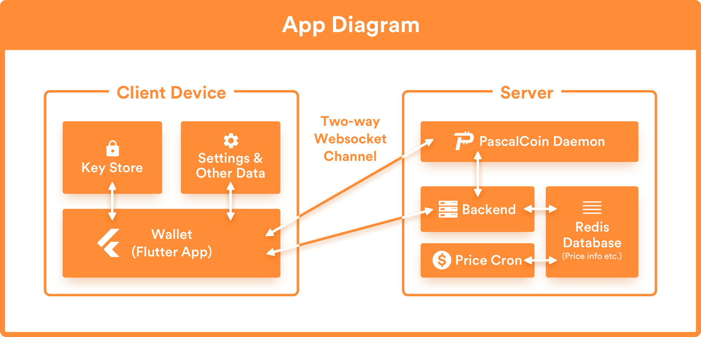
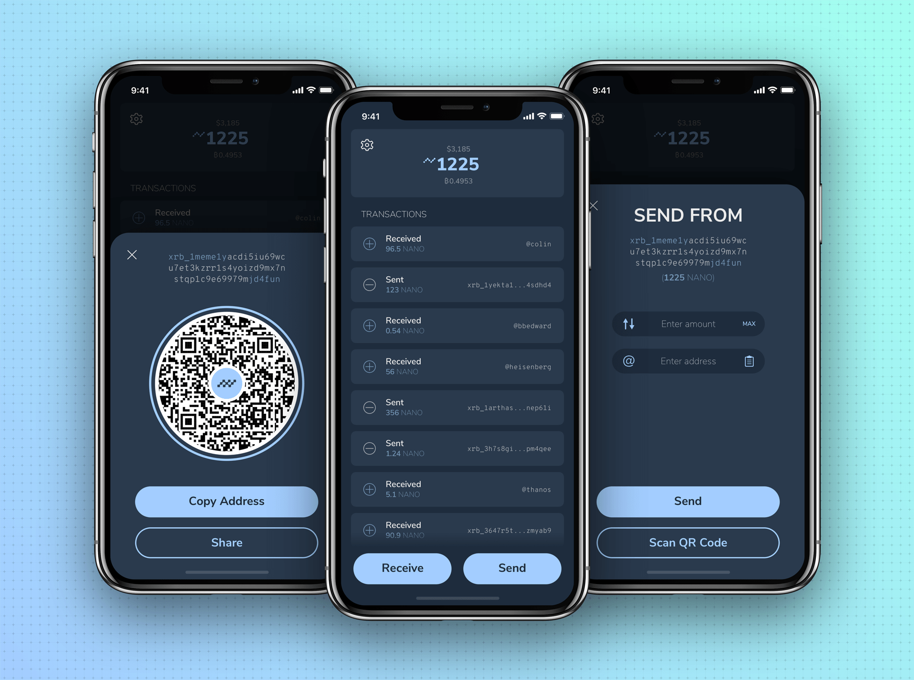
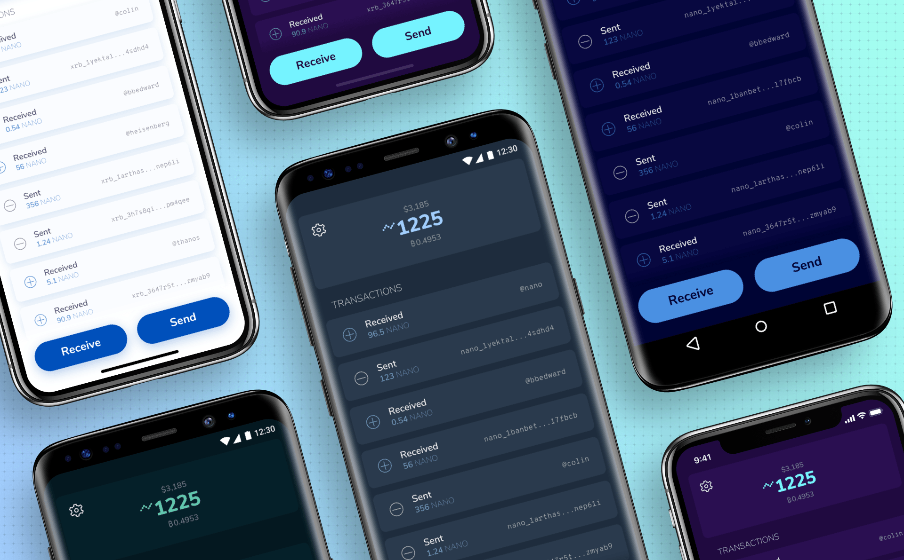
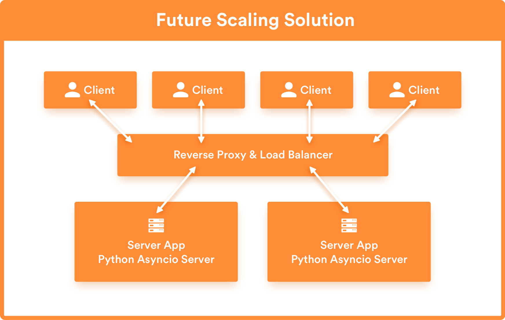

<pre>
  PIP: PIP-0031C
  Title: New Wallet: Multi-Platform
  Type: User Interface
  Impact: None
  Author(s): Appditto <hello@appditto.com>
  Copyright: Appditto, 2019 (All Rights Reserved)
  License: GNU Public License 
  Comments-URI: https://discord.gg/sJqcgtD (channel #pip-0031c)
  Status: Accepted
  Created: 2019-04-23
</pre>

## Summary

It is proposed to build a wallet using [Flutter][1] for iOS, Android, and potentially Desktop, with a server application that will be used to connect this wallet and potentially other wallets to the PascalCoin node and network.

## Motivation

The barrier for entry to many cryptocurrencies is often quite high. The average user may quickly feel overwhelmed when trying to setup a cryptocurrency wallet - old looking interfaces, confusing interface elements displayed at the fore front such as public keys, private keys, and other advanced verbage that people who are not already familiar with cryptocurrency don't understand without further explanation. This PIP aims to create a new wallet with an intuitive, fast interface that is well suited to newcomers as well as PascalCoin veterans.

Flutter is a cross-platform app development framework primarily backed by Google. It uses Dart as a programming language and it is ahead-of-time compiled into native arm/arm64 code which makes its performance indistinguishable from a native application. However, Flutter is currently only for Android and iOS platforms. While this PIP only covers Android, iOS, with the potential for expansion into desktop later - the motivation for this decision is described below. A web wallet may use the same backend described in this PIP, but the web wallet implementation itself is best suited for a separate proposal.

Flutter is currently limited to mobile-only - at least for the short term, but there's many reasons why a mobile-first approach should be the the top priority for a new PascalCoin wallet:
* Over [2.5 billion people][smartphone-stats] carry a smartphone world wide and the number is growing. Smartphones are easily accessible, highly portable thus making it not only easiest way to access and spend your PASC but also the easiest way to introduce new people to PascalCoin.
* Most modern smartphones allow for password locking, remote wiping, and [1.5 billion][biometric-stats] smartphones are projected to support biometrics by 2023. Android has supported physical secure elements since Android 4.x and most phones come equipped with such chips. All of these things combined make mobile devices a secure way to store and access your private keys.
* Quality smartphones [are becoming cheaper][smartphone-prices], thus making them even more accessible.

An approach using a native framework as Flutter also has several benefits over something like a standard web/html app:
* High-performance. Since Flutter compiles to Native code, it is very performant and fluid. A high-performing, fluid app is critical to the user experience. This wallet will also serve as the first introduction to PascalCoin for many people, that introduction should be a memorable one - a fast, fluid experience is a critical feature of this application.
* Full access to native Android and iOS APIs. With full access and easy integration with all of the native Android and iOS APIs that means the possibilities are endless. This wallet can take advantage of everything with no restrictions such as FaceID/TouchID, Fingerprint authentication on Android, NFC, [StrongBox Security][strongbox], and essentially all the same things that a native application can do.
* Google is actively developing [desktop embedding for Flutter][flutter-desktop]. The work for this has moved to the official Flutter repositories, and development for flutter desktop embedding can be followed on the [google forums](https://groups.google.com/forum/#!forum/flutter-desktop-embedding-dev)

## Specification

The goal of the new wallet is to achieve the following:

* Cover Android and iOS users from a single codebase immediately
* Support Linux, Mac, and Windows from the same codebase once [Flutter Desktop Embedding][flutter-desktop] matures.
* Design and implement an intuitive, easy-to-understand interface for the wallet.
* Create a robust PascalCoin light wallet server interface that can be re-usable for other apps
* Internationalization - offer numerous language options and currency conversions

This wallet is to be free and open source software.

### Architecture

The wallet is comprised of the following components:
* **Frontend**: The Flutter application that the user interracts with. Relies on the **Backend**  to interact with the PascalCoin network.
* **Backend**: This is an asyncio+aiohttp Python secure websocket server. The primary purpose is to manage price updates, store minimal data about subscribed users (such as preferred currency), and potentially deliver other things such as push notifications when the user's account has a new operation detected. The secondary purpose is to act as a passthru for the default **Node**. This is a convenience server that provides some user-conveniences that require a central server (streaming price updates, transaction updates, and ideally push notifications). It is not required for core wallet operation.
* **Node**: This is a full node, probably the PascalCoin daemon. The user can choose any node they want in the application settings and the app will operate normally. There will be a default **Node** operating remotely for wallet users to use, changing it will be an optional and secondary action.
  

**Key Points**
* All sensitive data is handled by the **Frontend**, this is the only thing the user interacts with. Users need to be able to install the app (Frontend) and be able to use it immediately without additional steps or interruption.
* The Backend can be easily hosted on any machine running Linux, Mac, or Windows as long as it has Python 3.6 or newer. The recommended deployment would be to a Unix server, due to the better support there with various WSGI servers such as gunicorn, uwsgi, etc.
* Push notifications rely on a central service and third-party, such as Firebase, in order to reliably deliver push notifications to a mobile device.
* The **Node** URL/Port can be changed in the settings so that the app will operate even in the event the central server goes offline.

### Frontend

The frontend is a critical part of this application as it is not only the way users interract with the wallet, but it's also where sensitive data such as private keys are stored - users need to be aware of this and make backups of data such as private key, address book, etc. As this data will never be transmitted to the backend.

* The frontend will be the entire Flutter application and is the only thing the user interacts with.
* It will have an on-boarding process that allows you to restore your wallet or create a new one, with explanations along the way.
* Localization information will be determined automatically based on the device locale and they will be able to change it later in settings if they choose to.
* A design will be provided in this PIP.
* The application needs to adapt content for all screen sizes - phone, tablet, and desktop.
* The frontend will run entirely client-side, all private keys will be stored here using the securest form of storage available on the device, transactions will be constructed here before being sent to the backend.
* With flutter's support for [native views][native-views], support for plugins/dapps could work through an interface using native webviews. They could also be supported in [Flutter packages][https://pub.dartlang.org/flutter] or provided in the codebase directly with minimal effect to the overall binary size.

The interface should be clean, unique, and fun.

The [Natrium][natrium] wallet also created by Appditto is an example of the ease-of-use and friendlyness that we want to achieve with the PascalCoin wallet.

This PIP wants to create a frontend that is intuitive and beautiful with feedback from the PascalCoin community.

### Backend

This is a Python [aiohttp][aiohttp] server. Python is easy to deploy on all architectures, can be easily scaled when paired with a WSGI server such as [gunicorn][gunicorn]. The goal is to buld a simple lightweight backend that can support a large number of connections. Python's asyncio module allows for high concurrency while a gunicorn deployment would allow for numerous worker processes to be added as needed.

The responsibilities of the backend are to
* Provide a variety of web socket APIs for clients to interact with
* Push updates to clients such as price updates, new transactions, push notifications.

While users can choose and run their own node/daemon to prevent the single point of failure problem, the backend is a central server that is optional - but desirable because it provides numerous conveniences:
* Potential for optional push notifications for various events
* Price data provided by server for the currency the user has selected
* The ability to add special handling for old and obsolete clients

There should be a default, highly-available server for use in this wallet where users can just pick it up and start using it as fast as possible. The basic structure above is easily scalable by simply adding more workers behind a reverse proxy and load balancer.

## Rationale

The approach outlined in this proposal is a high-performing, intuitive wallet that will be the primary way to introduce people to PascalCoin in the future.

## Backwards Compatibility

This change is backwards compatible and does not require a hard-fork activation. 

## Links

1. [Flutter][1]
2. [Flutter Desktop Embedding][flutter-desktop]
3. [AIOHttp - Python Asyncio Server][aiohttp]
4. [Natrium Wallet][natrium]
5. [Kalium Wallet][kalium]
6. [Native Views in Flutter][native-views]

[1]: https://flutter.io
[smartphone-stats]: https://www.statista.com/statistics/330695/number-of-smartphone-users-worldwide/
[biometric-stats]: https://www.pymnts.com/authentication/2018/biometrics-smartphone-mobile-security-fingerprint-sensors/
[smartphone-prices]: https://www.androidpolice.com/2015/08/28/editorial-the-rise-of-the-cheap-smartphone-is-finally-here-and-that-makes-me-happy/
[strongbox]: https://android-developers.googleblog.com/2018/10/building-titan-better-security-through.html
[flutter-desktop]: https://github.com/google/flutter-desktop-embedding
[aiohttp]: https://aiohttp.readthedocs.io/en/stable/
[gunicorn]: https://gunicorn.org/
[natrium]: https://natrium.io
[kalium]: https://kaba.banano.cc
[flutter-packages]: https://pub.dartlang.org/flutter
[native-views]: https://medium.com/@phoomparin/how-to-use-native-uis-in-flutter-with-swift-platform-view-8b4dc7f833d8
